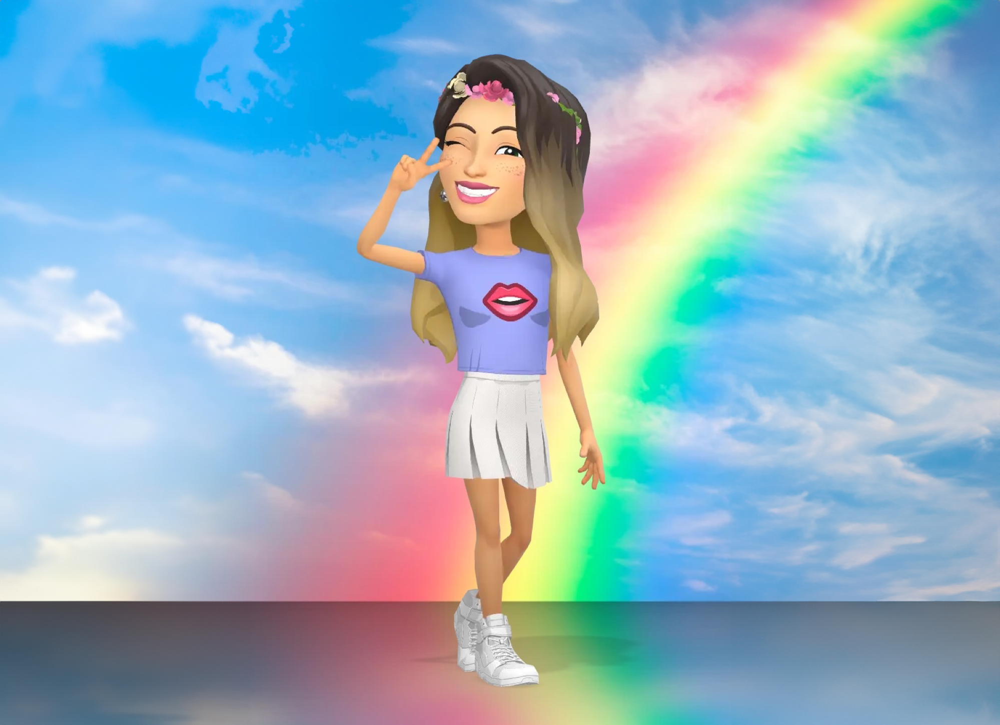

I worked on Snapchat's Design Engineering team, a close-knit group dedicated to rapid prototyping and pushing the boundaries of product innovation. My primary focus was on designing and prototyping 3D Bitmoji experiences using Unity and iOS. Our team's approach emphasized early-stage iteration and validation through small-scale testing, ensuring that our products met high standards of creativity and technical excellence.

  

